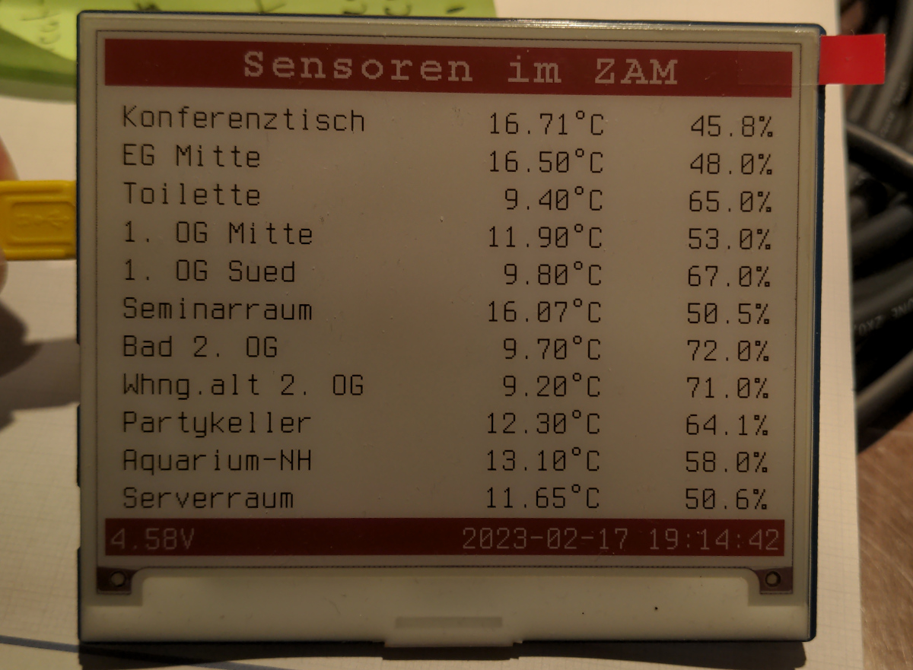

# ZAM sensor display.

The goal of this mini-project is to build a display
to show what the sensors at ZAM measured.

It uses a Waveshare "Pico e-Paper 4.2 B" 4.2 inch
three-color (Black-Red-White) ePaper-Display with
a Pi Pico W attached to the back.

It might be powered by a small crank power generator.

Status:
* Basic functionality is working now.
* Power saving surely could be improved.
* does not turn off automatically. Press both buttons at the same time to shut it down (clears the display to prevent it from burning in, which the manufacturer says can happen with its multi-color epaper displays).

